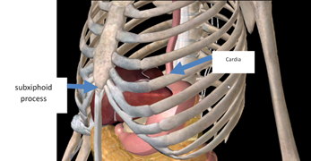

# Projects

<!-- TOC -->
* [Projects](#projects)
  * [Owls Worst Nightmare : Final engineering project ❤](#owls-worst-nightmare--final-engineering-project-)
  * [Ouch My Toe : Simple appointment scheduling API](#ouch-my-toe--simple-appointment-scheduling-api)
  * [Just Stick The Password On The Computer : Serious Game for cybersecurity in hospitals ❤](#just-stick-the-password-on-the-computer--serious-game-for-cybersecurity-in-hospitals-)
  * [French Public Hospitals On Windows XP: Building a RIS](#french-public-hospitals-on-windows-xp-building-a-ris)
  * [Burp : Non-invasive GERD detection for babies ❤](#burp--non-invasive-gerd-detection-for-babies-)
  * [Look At Meeeee ! CV interface for android](#look-at-meeeee--cv-interface-for-android)
  * [Terminator (But On Wheels, Quite Like A Vacuum Cleaner) : Robotics](#terminator-but-on-wheels-quite-like-a-vacuum-cleaner--robotics)
  * [Praise The Orange-Yellow-ish Color : Signal processing](#praise-the-orange-yellow-ish-color--signal-processing)
* [Machine Learning Projects](#machine-learning-projects)
  * [Giving The Voice Back: Voice synthesizer for people with voice loss ❤](#giving-the-voice-back-voice-synthesizer-for-people-with-voice-loss-)
  * [It’s TV Time ! EEG, ECG and respiration data analysis for detecting immersion levels](#its-tv-time--eeg-ecg-and-respiration-data-analysis-for-detecting-immersion-levels)
  * [I Have Eyes Now ! RAG Question Answering ❤](#i-have-eyes-now--rag-question-answering-)
  * [City OS - The Beginning : Face recognition](#city-os---the-beginning--face-recognition)
  * [⭐⭐⭐⭐⭐ : Sentiment analysis](#--sentiment-analysis)
  * [Chihuahua Vs. Muffins war](#chihuahua-vs-muffins-war)
  * [Oh Hell No : Coronary disease prediction](#oh-hell-no--coronary-disease-prediction)
* [Electronics projects :](#electronics-projects-)
  * [**Plethysmograph**](#plethysmograph)
  * [**Galvanic Skin Response Sensor**](#galvanic-skin-responsesensor)
  * [Phonocardiogram ❤](#phonocardiogram-)
* [Networks projects:](#networks-projects)
  * [Web server deployment with Ansible](#web-server-deployment-with-ansible)
  * [Multi-node Kubernetes with KIND](#multi-node-kubernetes-with-kind)
  * [Automatic attribution and securization of VLANs](#automatic-attribution-and-securization-of-vlans)
* [Future projects :](#future-projects-)
  * [Ouch My Toe 2 : Assessing pain in an objective fashion](#ouch-my-toe-2--assessing-pain-in-an-objective-fashion)
  * [Begone, Alexa ! Modify an Amazon Echo Dot and customize it](#begone-alexa--modify-an-amazon-echo-dot-and-customize-it)
  * [RTFM : Application to regroup all protocols for an hospital](#rtfm--application-to-regroup-all-protocols-for-an-hospital)
<!-- TOC -->

Favorite projects have a little emoji heart (❤) on them

## Owls Worst Nightmare : Final engineering project ❤

Research & development mainly with Python

Final internship project where I created a video processing tool to enhance consumers quality of experience.

Read more...

     
The videos were optimized using FFMPEG, for example the sound was normalized. The orientation of the videos are detected using a simple Resnet-18 model made from scratch, and the subtitles are generated by a fine-tuned instance of a Whisper-tiny model. 
    
Videos were managed via Redis, as a light broker, and with Azure Function Apps and storages.
    
A Make automation makes a call to an Azure function app when a new video arrives from VideoAsk.
    

    
    Flowchart of the project
    

## Ouch My Toe : Simple appointment scheduling API

A complete API made for making, modifying/seeing or deleting appointments. A PostgreSQL database stocks the appointments title, date, status, location, etc. Data is validated with Pydantic.

## Just Stick The Password On The Computer : Serious Game for cybersecurity in hospitals ❤

Making of a multi-player game in Gamemaker using Python, to raise awareness about good cybersecurity practices in hospital.

After I made the game crash and corrupt our backup-less file by trying to implement a mini-quiz, we mutually agreed to let me manage the game design and graphics instead.

See more...

 

    

    

    “Mañuel” snippet

## French Public Hospitals On Windows XP: Building a RIS

Implement a Radiology Information System to manage patients data, resources, medical examination reports, statistics... For the graphical part, welcome back to 2005.

Read more...

 

I used ThaiRIS open source project as our RIS. I had to connect it to a PACS (Picture Archieving and Communicating System that uses DICOM norms) and to a visualization system, but we didn’t manage to connect them in time.
    

    

## Burp : Non-invasive GERD detection for babies ❤

Engineering project with minimal supervision. Brainstorming for the original idea, and project implementation following agile methods.

Gastroesophageal Reflux Disease (GERD) is due to a dysfunction of the cardia , the upper sphincter closing the stomach. In cases of reflux, stomach acid can rise up to the mouth, leading to discomfort or a burning sensation. 

Read more...

 
    
Babies suffering from GERD can be treated over a short period with medications such as proton pump inhibitors (PPIs), antacids, and prokinetic drugs. These have some secondary effects : nausea, diarrhea, abdominal pain…
    

    
    Accelerometer actual picture, and schematic representations.
    
A mechanical and simple treatment is to elevate the head of the bed by 30°, but has to be watched carefully because of the risks of newborn sudden death.
    
The project was to use a small accelerometer as a non-invasive method to detect movement in the lower esophagus part, thus detecting acidic reflux AND non-acidic reflux (an innovation !!! Wow !!!)
    

    
    The sensor would be placed on the subxiphoid process…
    

    
    …on the baby’s torso.
    
The signal is processed, and when an acceleration is detected, the bed elevates for a short period of time, and then goes back to its original position. A mobile application receives a notification to alert the parents. They can choose to disable the automatic mode, or to customize it.
    

    
    Bed mechanical schema.
    

    
    Computer application interface. 

## Look At Meeeee ! CV interface for android

Development of a small interface in Flutter with android studio to present my curriculum vitae.

<figure class="video_container">
  <iframe src="../assets/images/projects/424921155_7279189122160841_108485674593356398_n.mp4" allowfullscreen="true">
</iframe>
</figure>

[424921155_7279189122160841_108485674593356398_n.mp4](assets/images/projects/424921155_7279189122160841_108485674593356398_n.mp4)
