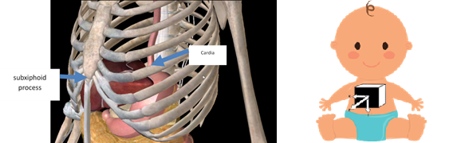
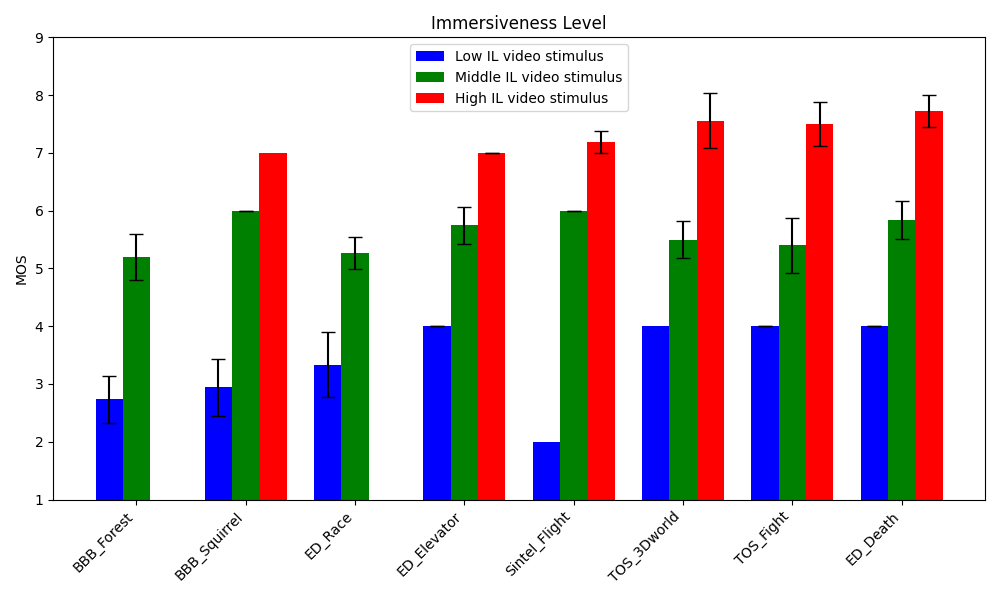

* [Various projects](#owls-worst-nightmare--final-engineering-project-)
* [Machine Learning Projects](#giving-the-voice-back-voice-synthesizer-for-people-with-voice-loss-)
* [Electronics projects](#plethysmograph)
* [Networks projects](#web-server-deployment-with-ansible)
* [Future projects](#ouch-my-toe-2--assessing-pain-in-an-objective-fashion)

Favorite projects have a little emoji heart (❤) on them

<h1 style="text-align: center; color: #f21368">Various projects</h1>

## Owls Worst Nightmare : Final engineering project ❤

Research & development mainly with Python

Final internship project where I created a video processing tool to enhance consumers quality of experience.

Read more...

     
The videos were optimized using FFMPEG, for example the sound was normalized. The orientation of the videos are detected using a simple Resnet-18 model made from scratch, and the subtitles are generated by a fine-tuned instance of a Whisper-tiny model. 
    
Videos were managed via Redis, as a light broker, and with Azure Function Apps and storages.
    
A Make automation makes a call to an Azure function app when a new video arrives from VideoAsk.

<figure>
  
  <figcaption>Flowchart of the project.</figcaption>
</figure>

## Ouch My Toe : Simple appointment scheduling API

A complete API made for making, modifying/seeing or deleting appointments. A PostgreSQL database stocks the appointments title, date, status, location, etc. Data is validated with Pydantic.

## Just Stick The Password On The Computer : Serious Game for cybersecurity in hospitals ❤

Making of a multi-player game in Gamemaker using Python, to raise awareness about good cybersecurity practices in hospital.

After I made the game crash and corrupt our backup-less file by trying to implement a mini-quiz, we mutually agreed to let me manage the game design and graphics instead.

See more...

 
<figure>
  
</figure>
<figure>
  
  <figcaption>“Mañuel” snippet.</figcaption>
</figure>

## French Public Hospitals On Windows XP: Building a RIS

Implement a Radiology Information System to manage patients data, resources, medical examination reports, statistics... For the graphical part, welcome back to 2005.

Read more...

 

I used ThaiRIS open source project as our RIS. I had to connect it to a PACS (Picture Archieving and Communicating System that uses DICOM norms) and to a visualization system, but we didn’t manage to connect them in time.

<figure>
  
</figure>
<figure>
  
</figure>

## Burp : Non-invasive GERD detection for babies ❤

Engineering project with minimal supervision. Brainstorming for the original idea, and project implementation following agile methods.

Gastroesophageal Reflux Disease (GERD) is due to a dysfunction of the cardia , the upper sphincter closing the stomach. In cases of reflux, stomach acid can rise up to the mouth, leading to discomfort or a burning sensation. 

Read more...

 
    
Babies suffering from GERD can be treated over a short period with medications such as proton pump inhibitors (PPIs), antacids, and prokinetic drugs. These have some secondary effects : nausea, diarrhea, abdominal pain…
<figure>
  
  <figcaption>Accelerometer actual picture, and schematic representations.</figcaption>
</figure>    

    
A mechanical and simple treatment is to elevate the head of the bed by 30°, but has to be watched carefully because of the risks of newborn sudden death.

    
The project was to use a small accelerometer as a non-invasive method to detect movement in the lower esophagus part, thus detecting acidic reflux AND non-acidic reflux (an innovation !!! Wow !!!)

<figure>
  
  <figcaption>The sensor would be placed on the subxiphoid process……on the baby’s torso.</figcaption>
</figure>  
 
The signal is processed, and when an acceleration is detected, the bed elevates for a short period of time, and then goes back to its original position. A mobile application receives a notification to alert the parents. They can choose to disable the automatic mode, or to customize it.

<figure>
  
  <figcaption>Bed mechanical schema.</figcaption>
</figure>
<figure>
  
  <figcaption>Computer application interface.</figcaption>
</figure>

## Look At Meeeee ! CV interface for android

Development of a small interface in Flutter with android studio to present my curriculum vitae.

<video width="304" height="656" controls>
  <source src="../assets/images/projects/424921155_7279189122160841_108485674593356398_n.mp4" type="video/mp4">
</video>

## Terminator (But On Wheels, Quite Like A Vacuum Cleaner) : Robotics

Controlling a virtual e-puck robot on Cyberbotics’s WeBot software

Writing a program in python that read from the ePuck's sensors and can control it to explore a map until finding a green ball.

<figure>
  
</figure>
<figure>
  
  <figcaption>Robot and green ball in a 3d labyrinth.</figcaption>
</figure>

## Praise The Orange-Yellow-ish Color : Signal processing

Creation of an interface on Matlab allowing the user to simulate a signal by selecting parameters such as lowest value or slope , add noise to it, extract the parameters and analyze the relative error evolution.

4 models are available : Linear, Exponential, Power and Logarithmic.
<figure>
  
</figure>

<h1 style="text-align: center; color: #f21368">Machine Learning Projects</h1>

## Giving The Voice Back: Voice synthesizer for people with voice loss ❤

Creating a vocal synthesizer that would be able to recreate the patient’s former voice, and to speak France's local languages (Breton, Patois, Occitan…) and write a publication (in the publications tab!!!)

This project uses So-VITS-SVC (State-of-the-art Variational Inference-based Text-to-Speech (TTS) Vocoder with Speech Conversion), which is a neural network designed for speech synthesis. It can extract speaker’s embeddings and vocoders to reproduce waveforms.
<figure>
  
  <figcaption>Example of training data : spectrogram from the first Mozilla Common voice Breton file…</figcaption>
</figure>

<figure>
  
  <figcaption>...To convert then to a log-mel spectrogram for better machine readability.</figcaption>
</figure>

This project is incomplete as it requires quite a lot of space and power (mp3 training data is really heavy). I wish to complete it someday.

## It’s TV Time ! EEG, ECG and respiration data analysis for detecting immersion levels

Analysis of multimodal data to predict participant immersion level while watching videos.
<figure>
  
  <figcaption>The immersion increases with media quality (image and sound)</figcaption>
</figure>
<figure>
  
  <figcaption>Confusion matrix for predicting levels of immersion</figcaption>
</figure>
<figure>
  
  <figcaption>And corresponding, absolutely awful accuracy. 5d hyperspace tables are not for me.</figcaption>
</figure>

## I Have Eyes Now ! RAG Question Answering ❤

Give a 10-pages PDF file to a RAG, ask a question and get an answer.

Read more...

 
**Ask a question :**
    
"Comment sont évacués les déchets du système sanguin?”
    
**Get the right** information **page** (here it’s the second one) :
<figure>
  
</figure>
    
**Get the answer :**
    
“Les déchets du système sanguin sont évacués de deux façons :
    
1. Le dioxyde de carbone est éliminé au niveau du système respiratoire.
2. Les autres déchets (urée, acide urique, etc.) sont éliminés au niveau des reins chez les mammifères.”

## City OS - The Beginning : Face recognition

Using MTCNN and an instance of an Inception-Resnet V1, we manage to create a model that recognizes 1 subject among 128. However, with too much accessories, the model struggles to understand the resemblance. 

<figure>
  
  <figcaption>Faces of the 96th identity recognized by MTCNN.</figcaption>
</figure>

<figure>
  
  <figcaption>Faces of the 96th identity not recognized by MTCNN.</figcaption>
</figure>

## ⭐⭐⭐⭐⭐ : Sentiment analysis

Creation of an app in python that allows the user to write a text for input, and
makes a prediction on the star rating, and its probability. It
handles exceptions and errors and writes messages.

## Chihuahua Vs. Muffins war

Train a model to differentiate chihuahuas from muffins (I can tell this works very well, not only because of the nice accuracy, but also because I would try to pet the second image to see if it reacts if I could! )
<figure>
  
</figure>

See you in the next episode : Pericarditis vs. Lasagna.

## Oh Hell No : Coronary disease prediction

Simple prediction of coronary disease probability using Kaggle dataset.

<h1 style="text-align: center; color: #f21368">Electronics projects</h1>

*Don’t ask me how but it works*

I did some very interesting electronics projects, but I feel like I'm not very good at it. However, I’m eager to improve in this domain because of its importance in project development. So, here comes nothing ! 
<figure>
  
</figure>

<iframe style="border: 0; width: 100%; height: 42px;" src="https://bandcamp.com/EmbeddedPlayer/album=551760206/size=small/bgcol=ffffff/linkcol=0687f5/track=2380902705/transparent=true/" seamless><a href="https://c418.bandcamp.com/album/minecraft-volume-beta">Minecraft - Volume Beta de C418</a></iframe>

*A little music to ease my soul and yours while reading*

## **Plethysmograph**

BPM sensor : the patient puts a finger between a LED and a phototransistor. A signal is created from the phototransistor, depending on the level of light received. With an oscilloscope, we can print and analyze the signal to determine the BPM of the patient.
<figure>
  
  <figcaption>BPM sensor model.</figcaption>
</figure>

## **Galvanic Skin Response Sensor**

Changes in physiology are directly expressed in the innervation of the skin. These expression can be measured as fluctuations in electrodermal activity. To prevent some troubles such as epileptic fits or a blackouts, we can analyze the evolution of electrodermal activity, thus create a biofeedback.
<figure>
  
  <figcaption>GSR sensor model.</figcaption>
</figure>

## Phonocardiogram ❤

Another way to get the BPM. For each heartbeat, a LED brightens. With a small piezo-electrical crystal, put on an artery (here, on the carotid artery), a signal is generated for each vibration and sent to the LED. 
<figure>
  
  <figcaption>Phonocardiogram model.</figcaption>
</figure>

<h1 style="text-align: center; color: #f21368">Networks projects</h1>

## Web server deployment with Ansible

Writing a playbook to use nginx on 3 VM.

## Multi-node Kubernetes with KIND

A MariaDB instance was deployed on 1 worker, and a pre-made app was deployed on the other.

## Automatic attribution and securization of VLANs

Configuration of a Cisco switch, RADIUS, DHCP servers, and of course creation of 5 VLANs.
<figure>
  
</figure>

<h1 style="text-align: center; color: #f21368">Future projects</h1>

## Ouch My Toe 2 : Assessing pain in an objective fashion

EEG, Blood biomarkers such as GNG7, CCND1, heart rate, blood pressure and pupillary diameter variability… So much perspectives to dig! 
<figure>
  
</figure>

## Begone, Alexa ! Modify an Amazon Echo Dot and customize it

Just burn Alexa

## RTFM : Application to regroup all protocols for an hospital

Each hospital has its own dozens of protocols. The complexity of the IT systems and practitioners’ lack of time results in walls covered in protocol posters.

<a href="https://kislapet.github.io/projects/">
    <button style="background-color: #f21368; align-self: center; border: none;padding: 15px 32px;font-size: 16px;border-radius: 12px;" >Scroll back</button>
</a>
