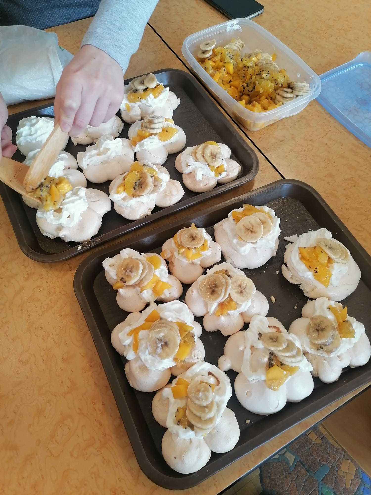
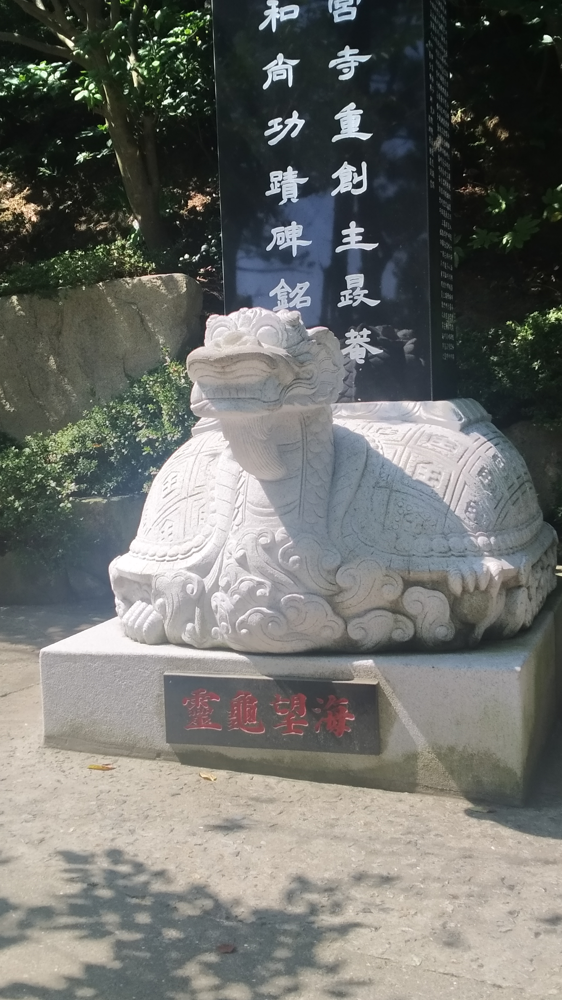
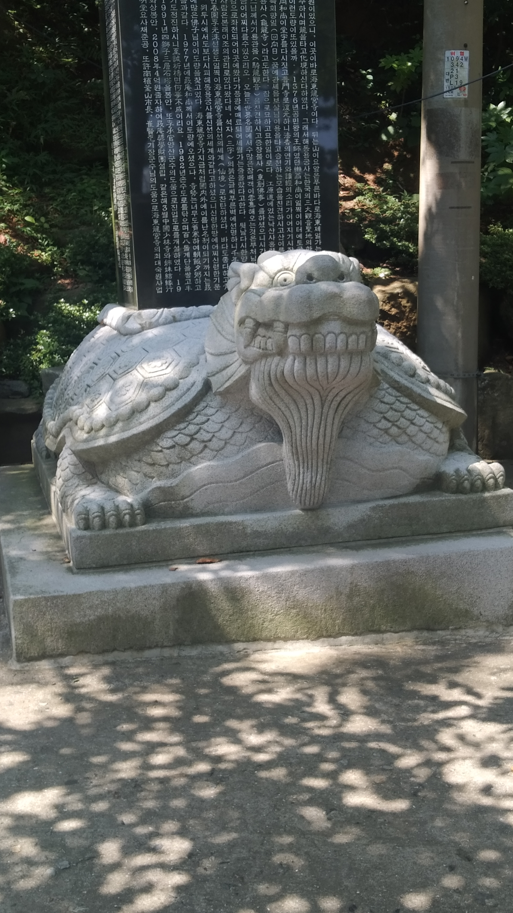
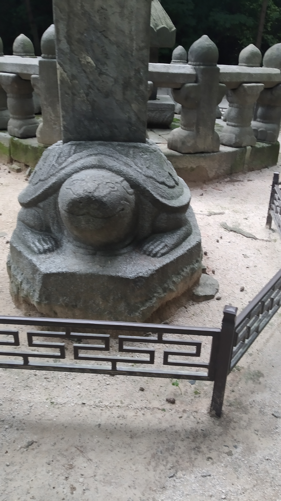
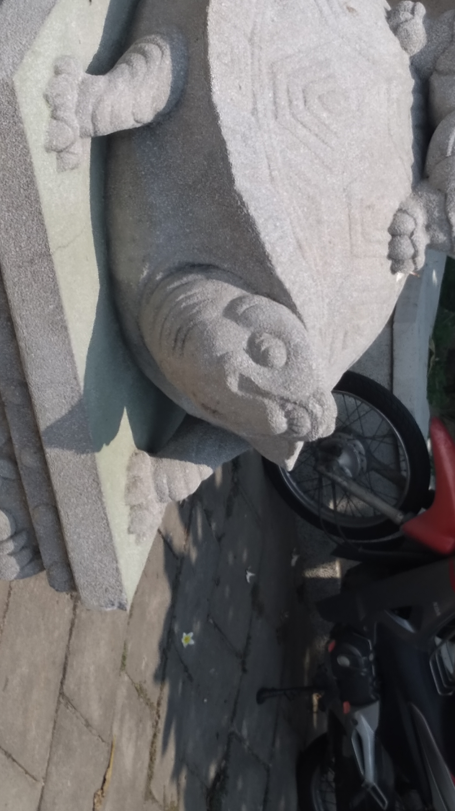
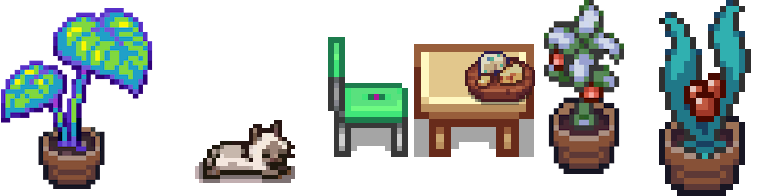

# Skills / Hobbies

# Music

## Drumming

I started learning drums in 2014.

Here are 3 of my favorites tracks to play on drums!

<iframe width="1695" height="718" src="https://www.youtube.com/embed/kb3Lt18iQUw" title="Judith" frameborder="0" allow="accelerometer; autoplay; clipboard-write; encrypted-media; gyroscope; picture-in-picture; web-share" referrerpolicy="strict-origin-when-cross-origin" allowfullscreen></iframe>

<iframe width="1695" height="718" src="https://www.youtube.com/embed/PeQAZsyucbQ" title="Arctic Monkeys - The View From The Afternoon (Official Video)" frameborder="0" allow="accelerometer; autoplay; clipboard-write; encrypted-media; gyroscope; picture-in-picture; web-share" referrerpolicy="strict-origin-when-cross-origin" allowfullscreen></iframe>

<iframe width="1695" height="718" src="https://www.youtube.com/embed/EAiksF4bHpg" title="Spiritbox - Eternal Blue" frameborder="0" allow="accelerometer; autoplay; clipboard-write; encrypted-media; gyroscope; picture-in-picture; web-share" referrerpolicy="strict-origin-when-cross-origin" allowfullscreen></iframe>

## Piano / Guitar

Before drums, I took piano lessons, so I’m able to read music sheets, but not really to improvise on piano.

When I was in high school, I took the music option. There was not enough guitarists, so during summer I learned all the basic chords to be able to accompany the other students. As the drum parts were sometimes really easy, I could teach others how to play them.

## Composing

When I first used FL Studio, I found it horribly complicated. So, I’m trying to learn it step by step by creating small themes using different styles or genres.

I managed to create this breakcore sample last year:

<audio controls>
  <source src="../assets/images/skills/Breakcore.mp3" type="audio/mpeg">
</audio>

# Cooking And Video Edit

For my second year of engineering school, I competed in a team to earn the right to be in the school’s Student Union. To achieve this goal, we had the idea to make a snack time with Pavlovas.
A Pavlova is a cake made of meringue and whip cream, covered in fruits. The whole is supposed to remind Anna Pavlova’s dance tutu, a famous Russian ballet dancer from the 19-20th century.

The mission was simple : communicate about the event, cook and manage the transportation of the pavlovas, then use all our charisma to convince the math’s teacher to let us leave earlier.

First, was the promotional video released on social media, trying to reproduce early television style, switching to Technicolor :

<iframe width="445" height="791" src="https://www.youtube.com/embed/QAws5rPVEGY" title="pavlova" frameborder="0" allow="accelerometer; autoplay; clipboard-write; encrypted-media; gyroscope; picture-in-picture; web-share" referrerpolicy="strict-origin-when-cross-origin" allowfullscreen></iframe>

Then, the making of the cakes (winter fruits version) :
<figure>
  
</figure>

Conclusion : thanks to magically found cardboard boxes, we were able to bring all meringues to school safely. We bought the teacher’s silence with a fresh baked Pavlova. What would have you done if you were him? 

# Pictures/Travels

Last year, I did my first alone trip. I left France for a semester in Vietnam, I went in Thaïland for Têt vacations, and finished by a solo-travel to Japan by earth and seas of 1 month and 1/2, to finally go back to Barcelona, and to France.

I have so much pictures that I can make slideshows that annoys my friends, but I will share here the most important : food and ugly tortoises.

<figure class="third">
  

  

  

  

  

  

  <figcaption>Yes, there is an outsider!</figcaption>
</figure>

<figure>
  
</figure>
